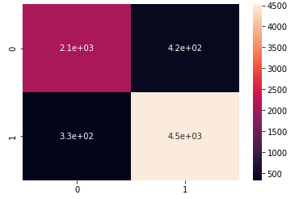

<h1 align="center"> NLP Challenge using Olist Dataset </h1>

## Link

- Google Colab Notebook - [NLP_Challenge_Olist_Dataset.ipynb](https://github.com/lizmarques/nlp_challenge_olist_dataset/blob/207e3e0fd4f7a2afceb378d8eb0479bf69ea0aea/NLP_Challenge_Olist_Dataset.ipynb)

## Data Source: Olist

This is a Brazilian ecommerce public dataset of orders made at Olist Store. The dataset has information of 100k orders from 2016 to 2018 made at multiple marketplaces in Brazil. Its features allows viewing an order from multiple dimensions: from order status, price, payment and freight performance to customer location, product attributes and finally reviews written by customers. There is also a geolocation dataset that relates Brazilian zip codes to lat/lng coordinates.

This is real commercial data, it has been anonymised, and references to the companies and partners in the review text have been replaced with the names of Game of Thrones great houses. (source: https://www.kaggle.com/datasets/olistbr/brazilian-ecommerce)

## Data exploration
### Review Score vs Quantity

Through this bar plot, we can conclude that the majority of reviews have a rating of 5, i.e. the maximum grade

 

#### Note 1
As the goal of this challenge is to build a classification model, we will need to create one more column that will be our class. Therefore, we will establish that:
"review_score" less than or equal to 3, will be classified as negative (receiving the value 0)
"review_score" greater than or equal to 4, will be classified as positive (receiving the value 1)

### Class vs Quantity

Here we can see that our database is unbalanced, since there are more positive records than negative ones.
As the calculations below show, we can see that positive records(1) correspond to 65.7% of the total database, against 34.3% of negative records (0).
     
 - Class 0: 8.479
 - Class 1: 16.243

 

## Text preprocessing tecniques
 - Removal of unwanted characters using regular expressions (re.sub(r"[\W\d_]+", " ", text)).
 - Stop words filtering.
 - Lemmatization, to represent words in their basic forms, such as infinitive of verbs and masculine singular of nouns and adjectives.
 - Tokenization, transforming sentences into numerical sequences, allowing computational analysis.

## Feature Extraction
### Method: TF-IDF (Term Frequency Inverse Document Frequency)
The TF-IDF method is made up of statistical measures to measure how important a word is in a document (text). Through it, it is possible to understand the importance of a word through punctuation.

This score is made by multiplying two terms: Term Frequency, which measures how often a term occurs in a document, and Inverse Document Frequency, which measures how important a term is in the context of all documents.

 

## Model: Logistic regression
### Confusion Matrix

 

### Classification Report

 

#### Note 2
Through this classification report metrics, we can see that the model has 90% accuracy.
When it correctly classifies a class 0 (negative) review, it has 86% accuracy.
When classifying a class 1 (positive) review, it has 92% accuracy. In other words, he is 92% sure that the review, in fact, belongs to class 1.

## Testing the model with new sentences
Here we can see that, at least for this new sample of 5 reviews, he classified them all correctly.

 

## Conclusion
After testing the model with new reviews, we can conclude that, with these samples, the model performed as expected and made the classifications correctly.
Still, there is always room for improvement. Therefore, a next step would be to test other classification algorithms and even neural networks to try to increase the model's accuracy.

## Extra Observations
I would like to point out that, during the development of this challenge, I also tested the Random Forest algorithm and it returned an accuracy of 88%. As the Logistic Regression was a little better, I chose to leave it as the "final model" of the challenge.
Furthermore, I also tested the model offered by the Spacy library, but it performed poorly with this database. Therefore, I decided to leave this option aside.

